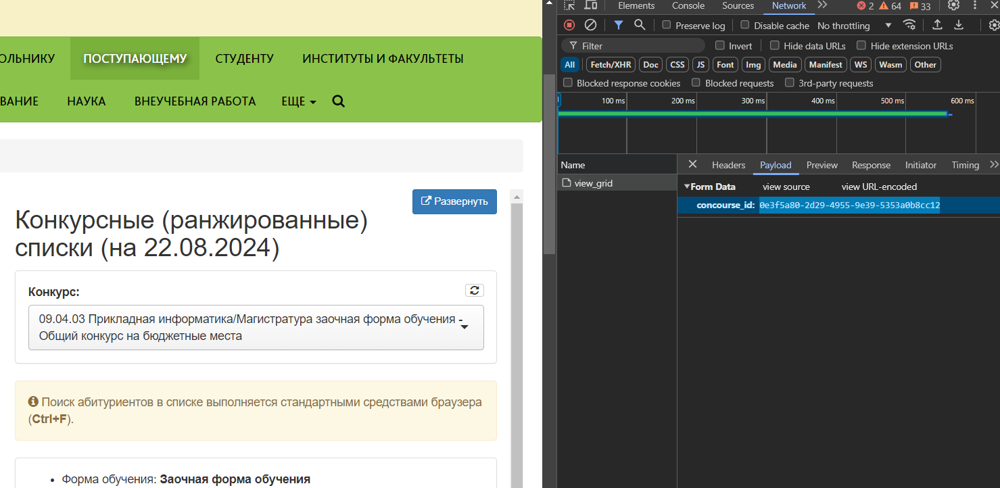

### Описание

Скрипт который выводит в терминал место в конкурсном списке и общее количество мест по направлению

### Пример вывода

```
10(5)/7
```

- 10 - текущее место в рейтинге
- (5) - текущее место в рейтинге с учетом сданных оригиналов
- 7 - общее количество мест по направлению

### Конфигурация

В файле `.env`

- SNILS - снилс
- CONCOURSE_ID - ИД направления. Можно получить на [этой страницы](https://pgsha.ru/candidate/rating_all/). Перед тем как выбриать конкрус нужно зайти в DevTools во вкладку `Network`. Выбрать конкурс. Открыть запрос `view_grid` и во вкладке `payload` получить `concourse_id`
  

### Требуется

```
nodejs >= 20.6.0
```

### Простое использование

```
node --env-file=.env main.js
```

### Запуск из терминала

Файл `pgatu.bat` позволяет запускать скрипт вводя в терминал windows `pgatu`. При этом файлы должны находиться в директории, которая записана в переменной среды (PATH)
